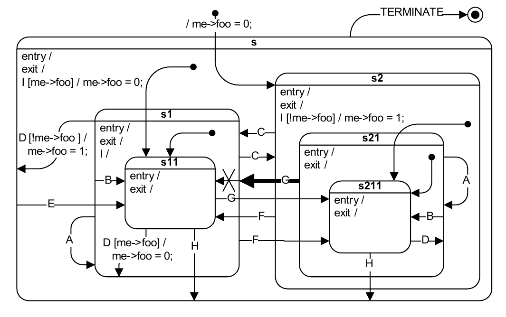
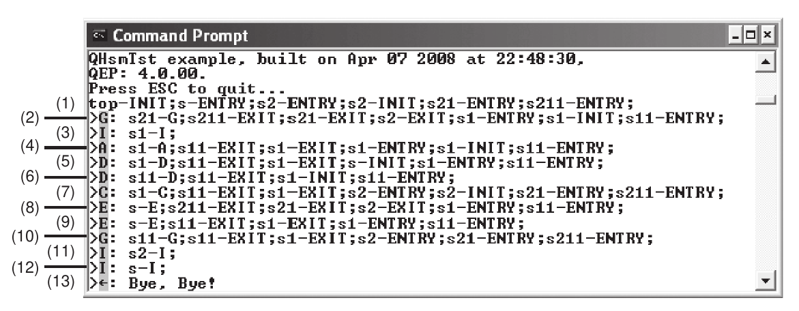

# Hsm
Hierarchical State Machine according to Stefan Heinzmann article in Overload Journal #64. This is the 
[article](http://accu.org/index.php/journals/252).

The code was found [here](https://github.com/aystarik/loader).

There is another [article](http://accu.org/index.php/journals/1548) in Overload elaborating on testable state machines.
They are not hierarchical though.

Code was updated to match test machine in [PSiCC2](https://www.state-machine.com/doc/PSiCC2.pdf) book 
(corrected version [Errata](https://www.state-machine.com/doc/PSiCC2_Updates+Errata.pdf)):


Test HSM output from the book:


Output from this Hsm:
```
Top-INIT;S-ENTRY;S2-ENTRY;S2-INIT;S21-ENTRY;S211-ENTRY;
g: S21-G;S211-EXIT;S21-EXIT;S2-EXIT;S1-ENTRY;S1-INIT;S11-ENTRY;
i: S1-I;
a: S1-A;S11-EXIT;S1-EXIT;S1-INIT;S11-ENTRY;
d: S1-D;S11-EXIT;S1-EXIT;S-INIT;S1-ENTRY;S11-ENTRY;
d: S11-D;S11-EXIT;S1-INIT;S11-ENTRY;
c: S1-C;S11-EXIT;S1-EXIT;S2-ENTRY;S2-INIT;S21-ENTRY;S211-ENTRY;
e: S-E;S211-EXIT;S21-EXIT;S2-EXIT;S1-ENTRY;S11-ENTRY;
e: S-E;S11-EXIT;S1-EXIT;S1-ENTRY;S11-ENTRY;
g: S11-G;S11-EXIT;S1-EXIT;S2-ENTRY;S21-ENTRY;S211-ENTRY;
i: S2-I;
i: S-I;

```
